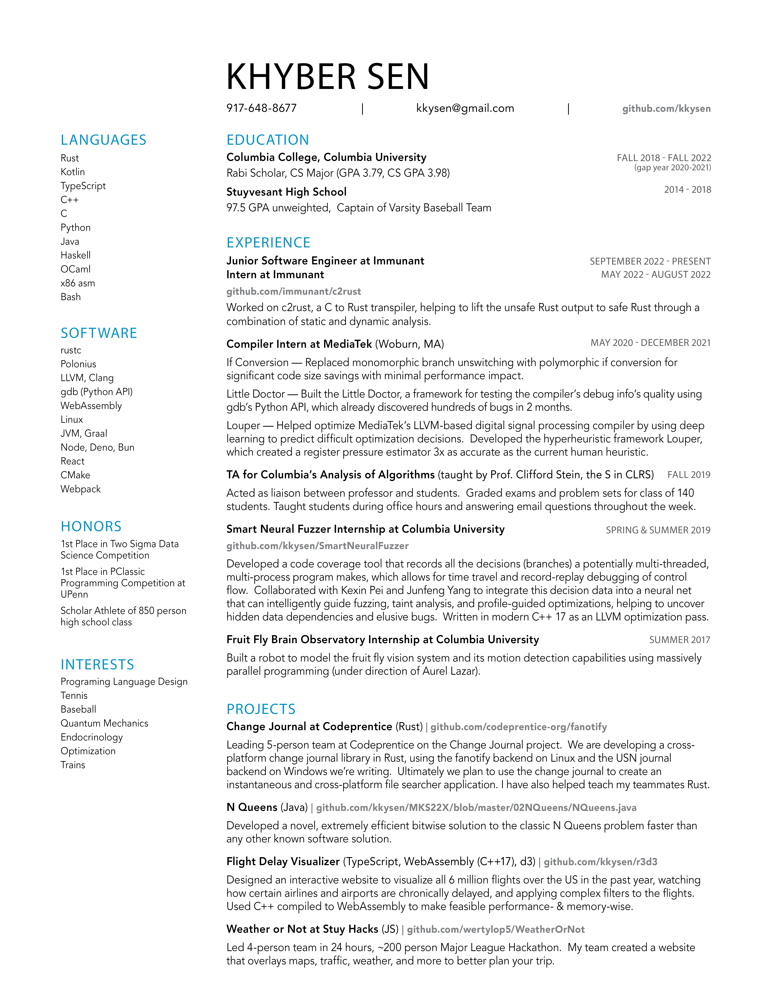

## Updating the resume

The resume source of truth is `Khyber_Sen_CV.yaml`,
rendered with [RenderCV](https://docs.rendercv.com/).
The Python side is managed with `uv`.

The initial `Khyber_Sen_CV.yaml` template was scaffolded with `uv run rendercv new "Khyber Sen"`,
then filled in by hand.

Render it with:

```sh
uv run rendercv render Khyber_Sen_CV.yaml
```

This generates multiple rendered formats in `rendercv_output/` (`.gitignore`d):
- `.md` Markdown
- `.typ` Typst
- `.html` HTML
- `.pdf` PDF
- `.png` PNGs

Only `Khyber_Sen_CV.md` is committed as a diff-friendly plain-text copy of the content at the repo root.

Add `--watch` to re-render automatically as you edit the YAML.
